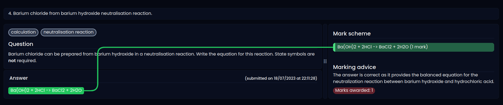
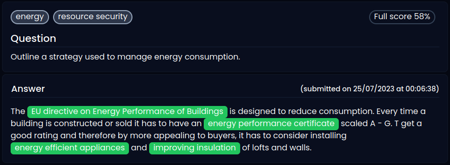
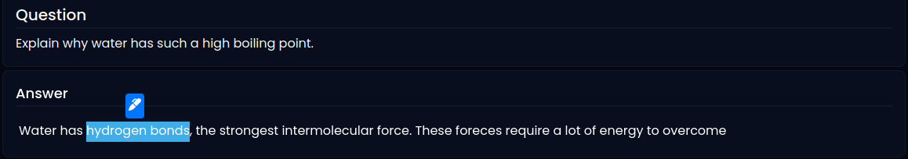

    <picture>
          <source media="(prefers-color-scheme: dark)" srcset="./img/logo-dark.svg">
          
    </picture>

Marka is a revision tool that allows students to get unbiased, automated feedback on practice exam questions questions. The development of this platform was part of a group side-project and an opportunity to learn new technologies.

Many online revision platforms are limited by their ability to provide quick feedback to students. Platforms attempt to overcome this by limiting the types of questions that they support to either multiple choice questions or gap-fill exercises. This enables inputs that are rigid enough to be marked using traditional business logic. These platforms usually are unable to account for natural language and symbols needed for equations or award marks for working out.

The above simplifications limit how close the questions simulate a real exam and prevent students from practicing the skills they need to apply their knowlege to solving problems.

Marka leverages ChatGPT and custom prompts to give explaniable feedback for large, free-form text based answers.

## Tech Stack

- **React + Vite** - to create an SPA.
- **Tailwind** - CSS styling framework allowing for styling to be managed entirely through utility classes.
- **tRPC** - Typesafe communication between frontend and backend
- **Postgres** - SQL database hosted on Amazon RDS.
- **ChatGPT** - using the completion API with GPT3.5 turbo.

## Using LLMs to enhance human marking

### Human marking supported

Once submitted, users can highlight text in thier answer and assign to points in the mark scheme. This will add the number of marks for the mark scheme to the total for the question.

Developing this feature required the use of the [Selection API](https://developer.mozilla.org/en-US/docs/Web/API/Selection_API), to correctly capture user input and deal with collisions - where a user highlights a selection of text that has already been assigned to a marking point. 

Once an automated marking is recieved, users can override the LLM to provide corrections in the marks awarded.

### Point in Time (PiT) History

Markings for a particular submission have point in time history caputed and along with metadata relating to the user, or automated agent that performed the marking.

This would allow for automated marking features to be analysed over time and improved.

